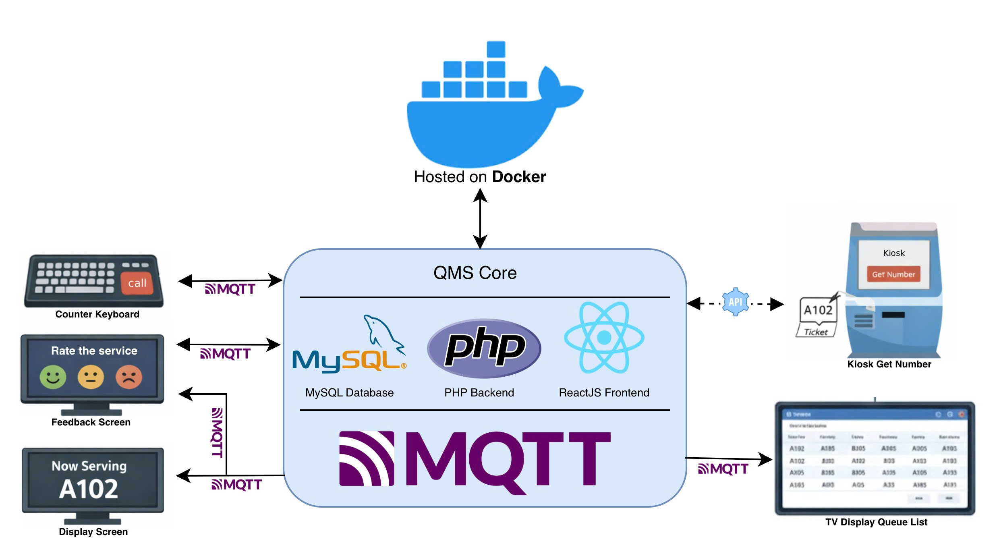
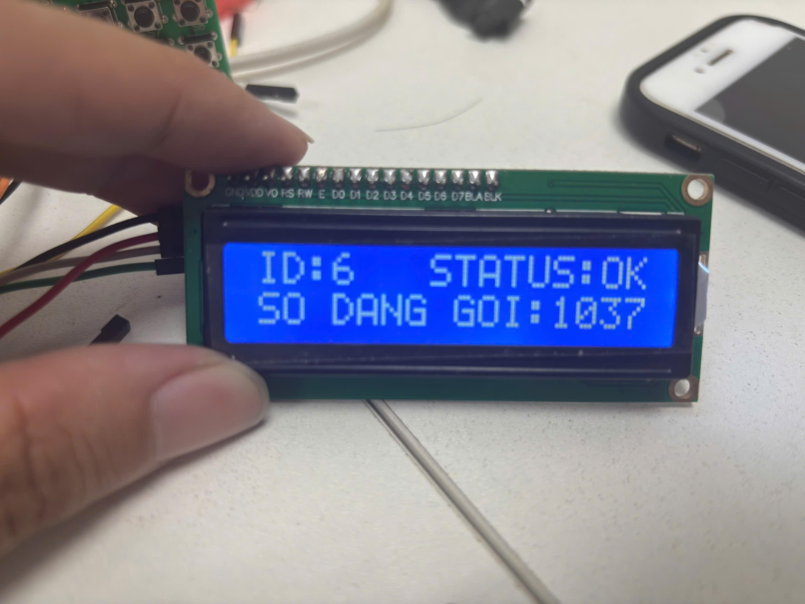
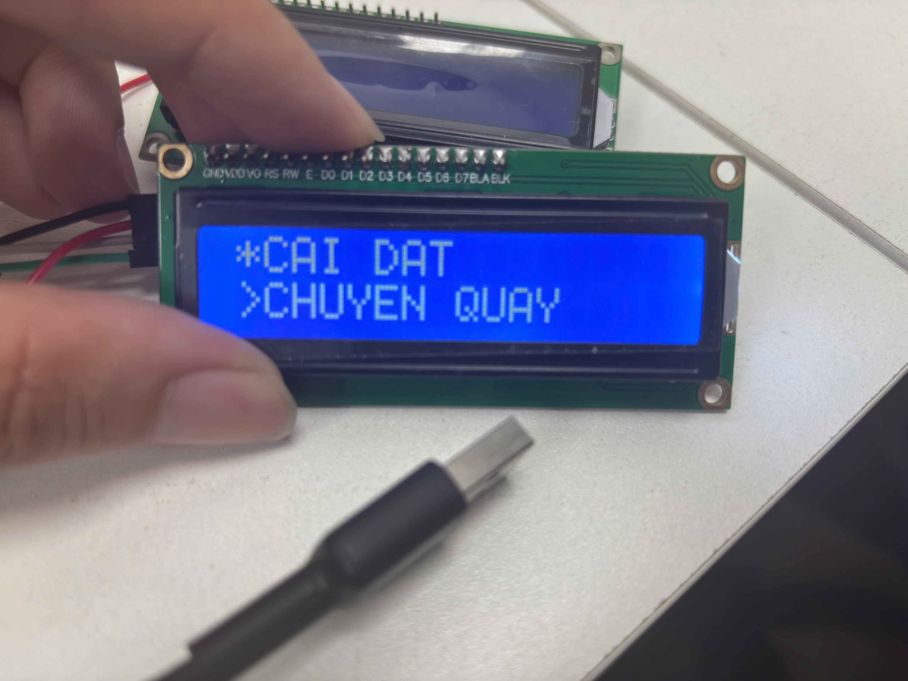
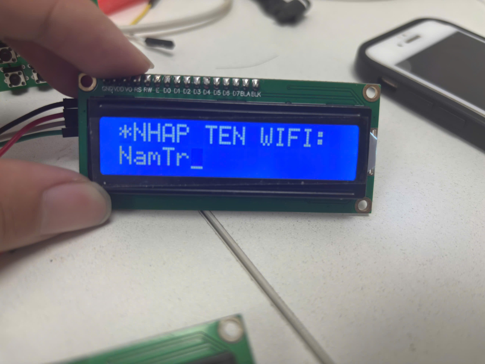
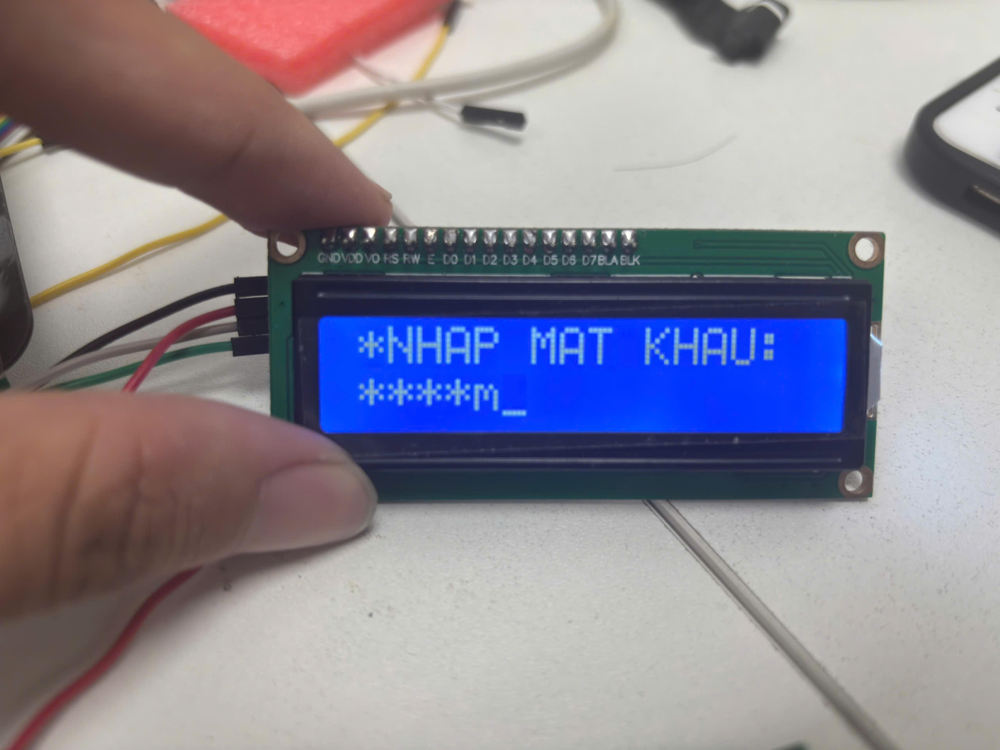
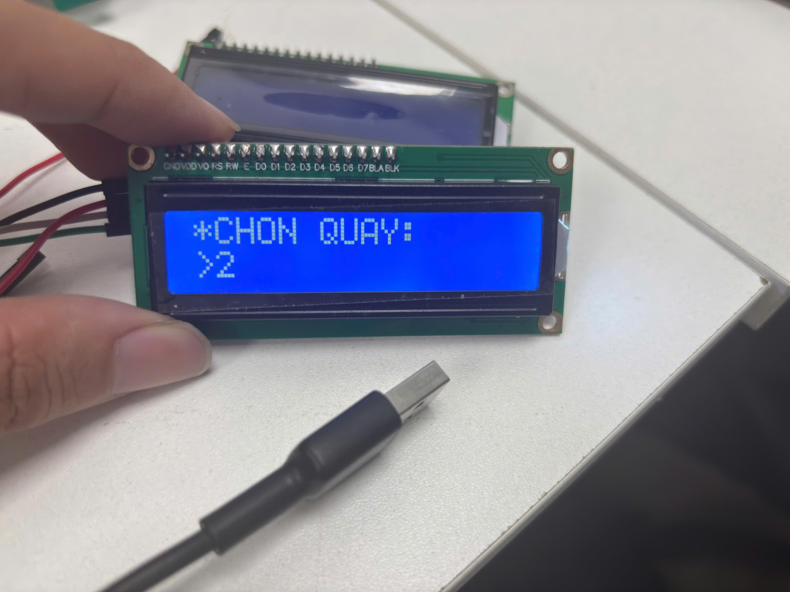
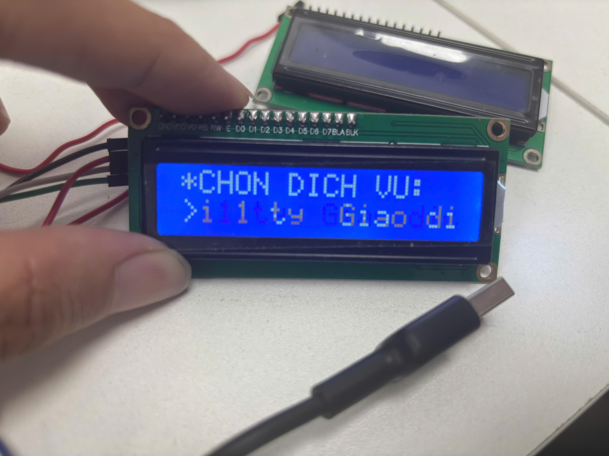

# QMS- CALLING NUMBER KEYPAD

Thiết bị gọi số thứ tự và đánh giá chất lượng dịch vụ,
ứng dụng cho ngân hàng, bệnh viện, cơ quan hành chính, quầy giao dịch.

Hệ thống cho phép:

- Nhân viên gọi số thứ tự khách hàng đến quầy dịch vụ
- Số được gọi sẽ được gửi đến màn hình gọi số để hiển thị và màn hình đánh giá chất lượng để lưu kết quả đánh giá
- Hiển thị thông tin rõ ràng, dễ sử dụng

<div align="center">
  
  <br>
  <em>Sơ đồ khối hệ thống xếp hàng</em>
</div>

---

## Features

- Gọi số tiếp theo
- Gọi lại số đang phục vụ
- Gọi số ưu tiên
- Bỏ qua số hiện tại
- Gọi số bị bỏ qua
- Hiển thị số đang phục vụ trên màn hình
- Hiển thị trạng thái kết nối server trên màn hình
- Hiển thị id của thiết bị trên màn hình
- Nhập wifi để kết nối và lưu thông tin wifi vào bộ nhớ NVS khi kết nối thành công
- Tự kết nối đến wifi đã lưu khi khởi động thiết bị
- Tự động kết nối lại wifi khi bị mất kết nối
- Reset số đang lưu và gửi lệnh reset số đến màn hình hiển thị và màn hình đánh giá chất lượng
- Gửi lệnh đến màn hình hiển thị đóng quầy

---

## System Overview

| Thiết bị | Mô tả                   | Chức năng                                                                                                 |
| -------- | ----------------------- | --------------------------------------------------------------------------------------------------------- |
| MCU      | ESP32                   | xử lý trung tâm, gửi và nhận dữ liệu đến server, màn hình hiển thị số và màn hình đánh giá thông qua MQTT |
| Keypad   | Bàn phím ma trận số 4x4 | Nhập số, ký tự và tùy chỉnh các chức năng của thiết bị                                                    |
| Display  | LCD 16x2                | Hiển thị thông tin như số đang gọi, dữ liệu nhập từ bàn phím, các chức năng của thiết bị, ...             |

## Pin Configuration

- Keypad Rows / Columns → GPIO
- LCD16x2 Display → I2C (PCF8574)

| PIN CỦA THIẾT BỊ NGOẠI VI | PIN ESP32   |
| ------------------------- | ----------- |
| COL1                      | GPIO_NUM_13 |
| COL2                      | GPIO_NUM_12 |
| COL3                      | GPIO_NUM_14 |
| COL4                      | GPIO_NUM_27 |
| ROW1                      | GPIO_NUM_32 |
| ROW2                      | GPIO_NUM_33 |
| ROW3                      | GPIO_NUM_25 |
| ROW4                      | GPIO_NUM_26 |
| SDA                       | GPIO_NUM_21 |
| SCL                       | GPIO_NUM_22 |

- Ma trận phím 4x4:
  | | C1 | C2 | C3 | C4 |
  |-----|----|----|----|----|
  | R1 | 1 | 2 | 3 | A |
  | R2 | 4 | 5 | 6 | B |
  | R3 | 7 | 8 | 9 | C |
  | R4 | ^ | 0 | DEL | D |

## Quy tắc bàn phím (T9-style)

| Phím | Ký tự / Chức năng    | Mô tả                                       |
| ---- | -------------------- | ------------------------------------------- |
| 0    | space (khoảng trắng) | Nhấn để chèn khoảng trắng và số 0           |
| 1    | ! ? @ # \*           | Ký tự đặc biệt                              |
| 2    | a b c 2              | Nhấn 1 lần: a, 2 lần: b, 3 lần: c, 4 lần: 2 |
| 3    | d e f 3              | d → e → f → 3                               |
| 4    | g h i 4              | g → h → i → 4                               |
| 5    | j k l 5              | j → k → l → 5                               |
| 6    | m n o 6              | m → n → o → 6                               |
| 7    | p q r s 7            | p → q → r → s → 7                           |
| 8    | t u v 8              | t → u → v → 8                               |
| 9    | w x y z 9            | w → x → y → z → 9                           |

**Lưu ý khi gõ phím:**

- Nhấn giữ hoặc nhấn nhanh liên tục để chuyển qua các ký tự trên cùng một phím.

## Project Structure

```

project/
├── main/
│ ├── esp_mqtt_client/
│ ├── keypad/
│ ├── lcd_i2c/
│ ├── led/
│ ├── mac_utils/
│ ├── mutex/
| ├── nvs_utils/
│ ├── state_machine/
│ └── wifi/
└── README.md
```

## WORKFLOW (State Machine)

Hệ thống hoạt động theo mô hình **State Machine**, mỗi trạng thái tương ứng với
một màn hình hiển thị và tập chức năng cụ thể.

---

### STATE_INIT – Khởi động hệ thống

- Thiết bị khởi động
- Khởi tạo các module:
  - LCD
  - Keypad
  - WiFi
  - MQTT
  - NVS
- Đọc thông tin WiFi đã lưu trong NVS, nếu chưa có thông tin wifi được lưu → **STATE_NO_WIFI**, nếu có thông tin → **STATE_WIFI_CONNECT**

---

### STATE_RUNNING – STATE chính của thiết bị

- Hiển thị:
  - Số đang gọi
  - ID thiết bị
  - Trạng thái kết nối (`OK / NO`) (OK nếu kết nối thành công đến server, NO nếu mất kết nối đến wifi hoặc server)
- Xử lý phím:
  - **B** → Gọi số tiếp theo
    - Nếu thất bại hiển thị `"GOI THAT BAI"`
  - **C** → Bỏ qua số hiện tại
  - **Nhập số (4 chữ số và là số đã được lấy từ kiosk) + D** → Gọi ưu tiên số đã nhập
  - **D (không nhập số)** → Gọi lại số hiện tại
  - **A** → Chuyển sang `STATE_MENU`

<div align="center">
  
  <br>
  <em>Màn hình chính</em>
</div>

---

### STATE_MENU – Menu chức năng

- LCD hiển thị danh sách chức năng thiết bị
- Xử lý phím:
  - **1** → Chuyển sang chức năng tiếp theo
  - **2** → Quay lại chức năng trước
  - **D** → Chọn chức năng
  - **A** → Thoát menu → `STATE_RUNNING`

<div align="center">
  
  <br>
  <em>Màn hình menu</em>
</div>

### Các chức năng có trong MENU

#### ▪ GOI LAI SO BO QUA

- nhấn D khi màn hình hiển thị chức năng này → Gửi tin nhắn đến server thông MQTT để lấy số → **STATE_RUNNING** (Hiển thị số tại màn hình chính)

#### ▪ CHUYEN QUAY

→ **STATE_DEVICE_LIST**

#### ▪ CHUYEN DICH VU

→ **STATE_SERVICE_LIST**

#### ▪ DANG KY TB

- Thiết bị gửi địa chỉ MAC đến server để đăng ký thiết bị thông qua web
- Hoàn tất → **STATE_RUNNING**

#### ▪ CHUYEN DICH VU

→ **STATE_SERVICE_LIST**

#### ▪ RESET

→ **STATE_CONTINUE**

---

### STATE_WIFI_RETRY:

- Retry 5 lần
- Thất bại → **STATE_WIFI_ERROR**
- Thành công → **STATE_WIFI_SUCCESS**

---

### STATE_WIFI_INPUT – State cấu hình WiFi

#### ▪ Nhập tên WiFi

- Màn hình LCD hiển thị ký tự nhập từ bàn phím,con trỏ sẽ nằm ở cuối chuỗi ký tự hiển thị trên lcd
- Nhập tên WiFi từ bàn phím
- **^** → Chuyển chữ hoa / chữ thường
- **D** → Chuyển sang nhập mật khẩu
- **DEL** → Xóa ký tự ở bên trái con trỏ
- **A** → Trở lại màn hình trước đó
- **B** → Di chuyển con trỏ sang trái, **nếu con trỏ di chuyển đến hết chuỗi ký tự hiển thị trên màn hình thì sẽ quay lại đầu chuỗi**
- **Tối đa 63 ký tự**
<div align="center">
  
  <br>
  <em>Màn hình nhập tên wifi</em>
</div>

#### ▪ Nhập mật khẩu

- Màn hình LCD hiển thị ký tự nhập từ bàn phím,con trỏ sẽ nằm ở cuối chuỗi ký tự hiển thị trên lcd
- Nhập mật khẩu WiFi
- **Mặc định hiển thị `*`**
- **C** → Ẩn / hiện mật khẩu
- **^** → Chuyển chữ hoa / chữ thường (**mặc định chữ thường**)
- **DEL** → Xóa ký tự vừa nhập
- **D** → Bắt đầu kết nối WiFi → `STATE_WIFI_CONNECT`
- **A** → Trở lại màn hình trước đó
- **B** → Di chuyển con trỏ sang trái, **nếu con trỏ di chuyển đến hết chuỗi ký tự hiển thị trên màn hình thì sẽ quay lại đầu chuỗi**
- **Tối đa 63 ký tự**
<div align="center">
  
  <br>
  <em>Màn hình nhập mật khẩu </em>
</div>

---

## STATE_WIFI_CONNECT

- Màn hình LCD hiển thị "TRANG THAI WIFI: DANG KET NOI"
- **Không xử lý phím nhấn tại state này**
- Nếu kết nối thành công → **STATE_WIFI_SUCCESS**
- **Nếu kết nối thất bại sẽ retry 5 lần**
- Nếu kết nối thất bại sau 5 lần retry → **STATE_WIFI_ERROR**

---

## STATE_WIFI_SUCCESS

- Màn hình LCD hiển thị "TRANG THAI WIFI: THANH CONG!" trong 1s
- **Không xử lý phím nhấn tại state này**
- Sau 1s hiển thị → **STATE_RUNNING**

---

## STATE_WIFI_ERROR

- Màn hình LCD hiển thị "TRANG THAI WIFI: THAT BAI!" trong 1s
- **Không xử lý phím nhấn tại state này**
- Sau 1s hiển thị → **STATE_RUNNING**

---

## STATE_NO_WIFI

- Màn hình LCD hiển thị "TRANG THAI WIFI: THAT BAI!" trong 1s
- **Không xử lý phím nhấn tại state này**
- Sau 1s hiển thị → **STATE_RUNNING**

---

### STATE_DEVICE_LIST – Chuyển quầy

- Hiển thị danh sách ID các thiết bị trong hệ thống
- Xử lý phím:
  - **1** → Chuyển tới thiết bị tiếp theo
  - **2** → Quay lại thiết bị trước
  - **D** → Chọn quầy
- Sau khi chọn:
  - Chuyển số đang xử lý đến màn hình đánh giá và màn hình hiển thị số
  - Hoàn tất → `STATE_RUNNING`

<div align="center">
  
  <br>
  <em>Màn hình chọn quầy</em>
</div>

---

### STATE_SERVICE_LIST – Chuyển dịch vụ

- Hiển thị danh sách dịch vụ
- Xử lí phím:
  - **1** → Chuyển tới thiết bị tiếp theo
  - **2** → Quay lại thiết bị trước
  - **D** → Chọn dịch vụ
  - **A** → Quay về màn hình trước đó
- Sau khi chọn dịch vụ → **STATE_SERVICE_POSITON**

<div align="center">
  
  <br>
  <em>Màn hình chọn dịch vụ</em>
</div>

---

### STATE_SERVICE_POSITON – Chọn vị trí để chuyển dịch vụ

- Hiển thị vị trí dịch vụ
- Xử lí phím:
  - **1** → Đầu dịch vụ
  - **2** → Cuối dịch vụ
  - **D** → Chọn vị trí dịch vụ
  - **A** → Quay về màn hình trước đó
- Sau khi chọn vị trí dịch vụ → Gửi yêu cầu đến server→ **STATE_SERVICE_POSITON**

---

### STATE_CONTINUE – Tiếp tục hay không

- Xử lí phím:
  - **1** → YES
  - **2** → NO
  - **A** → Quay lại
- chọn YES → Thực hiện Reset/Closed
- Hoàn tất → **STATE_RUNNING** (chọn reset) hoặc **STATE_CLOSED** (chọn đóng quầy)

---

### STATE_RESET – Reset thiết bị

- Xóa số đang xử lý hiện tại
- Gửi lệnh reset đến:
  - Màn hình đánh giá
  - Màn hình hiển thị số
- Chuyển về `STATE_RUNNING`

---

### STATE_CLOSED – Đóng quầy

- Gửi lệnh hiển thị đến màn hình hiển thị dòng chữ`"QUẦY TẠM THỜI ĐÓNG"`
- Khóa chức năng gọi số
  → `STATE_LOGOUT`

---

### STATE_LOGOUT – Quầy bị khóa

- Vô hiệu hóa các chức năng gọi số
- **A** → Thoát chế độ khóa → `STATE_RUNNING`

## Error Handling

- WiFi retry: 5 lần
- MQTT reconnect: tự động
- Mất kết nối đến server hoặc mất kết nối wifi: hiển thị "STATUS:NO" trên màn hình LCD

---

| Supported Targets | ESP32 | ESP32-C2 | ESP32-C3 | ESP32-C5 | ESP32-C6 | ESP32-C61 | ESP32-H2 | ESP32-H21 | ESP32-H4 | ESP32-P4 | ESP32-S2 | ESP32-S3 | Linux |
| ----------------- | ----- | -------- | -------- | -------- | -------- | --------- | -------- | --------- | -------- | -------- | -------- | -------- | ----- |

# Hello World Example

Starts a FreeRTOS task to print "Hello World".

(See the README.md file in the upper level 'examples' directory for more information about examples.)

## How to use example

Follow detailed instructions provided specifically for this example.

Select the instructions depending on Espressif chip installed on your development board:

- [ESP32 Getting Started Guide](https://docs.espressif.com/projects/esp-idf/en/stable/get-started/index.html)
- [ESP32-S2 Getting Started Guide](https://docs.espressif.com/projects/esp-idf/en/latest/esp32s2/get-started/index.html)

## Example folder contents

The project **hello_world** contains one source file in C language [hello_world_main.c](main/hello_world_main.c). The file is located in folder [main](main).

ESP-IDF projects are built using CMake. The project build configuration is contained in `CMakeLists.txt` files that provide set of directives and instructions describing the project's source files and targets (executable, library, or both).

Below is short explanation of remaining files in the project folder.

```
├── CMakeLists.txt
├── pytest_hello_world.py      Python script used for automated testing
├── main
│   ├── CMakeLists.txt
│   └── hello_world_main.c
└── README.md                  This is the file you are currently reading
```

For more information on structure and contents of ESP-IDF projects, please refer to Section [Build System](https://docs.espressif.com/projects/esp-idf/en/latest/esp32/api-guides/build-system.html) of the ESP-IDF Programming Guide.

## Troubleshooting

- Program upload failure
  - Hardware connection is not correct: run `idf.py -p PORT monitor`, and reboot your board to see if there are any output logs.
  - The baud rate for downloading is too high: lower your baud rate in the `menuconfig` menu, and try again.

## Technical support and feedback

Please use the following feedback channels:

- For technical queries, go to the [esp32.com](https://esp32.com/) forum
- For a feature request or bug report, create a [GitHub issue](https://github.com/espressif/esp-idf/issues)

We will get back to you as soon as possible.
